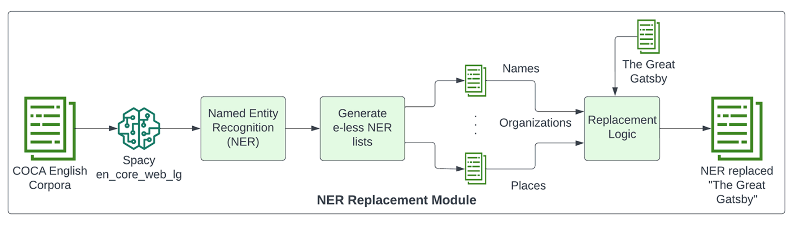
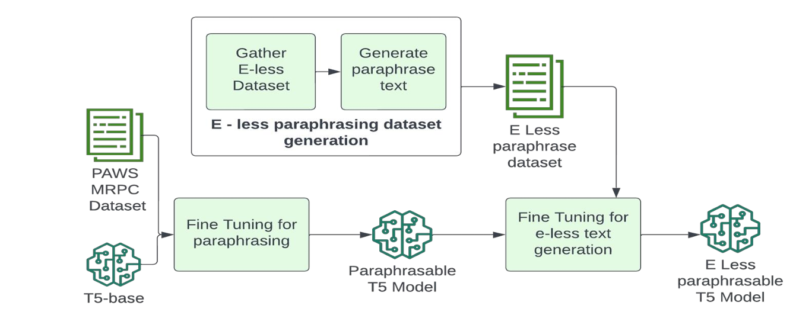

# E Less Enigma: Text Paraphrasing with T5 and BART

## Introduction
Welcome to E Less Enigma, an advanced text paraphrasing tool built using state-of-the-art language models such as T5 (Text-To-Text Transfer Transformer) and BART (Bidirectional and Auto-Regressive Transformers). This project aims to provide users with a powerful and versatile solution for generating constrained paraphrases of input text while preserving the original meaning and context. Whether you're a student, researcher, or content creator, E Less Enigma offers a convenient way to generate diverse variations of text for various purposes, such as improving readability, enhancing creativity, or avoiding plagiarism.

Please find the full project report [here](Project_Report.pdf).




### Key Features:
- Utilizes cutting-edge language models for text paraphrasing.
- Supports customizable input and output formats.
- Offers fine-tuning options for customizing paraphrasing behavior.
- Provides seamless integration with existing workflows through Python libraries and command-line interfaces.
- Enables efficient generation of paraphrased text for large datasets using parallel processing techniques.

## Installation
To get started with E Less Enigma, you'll need to install the required dependencies and set up the project environment. Follow these steps to install the necessary components:

1. Clone the repository to your local machine:
```bash
git clone https://github.com/your-username/e-less-enigma.git
cd e-less-enigma
```

2. Install the required Python packages using pip:
```bash
pip install -r requirements.txt
```

3. Optionally, you can install additional language models or fine-tune existing models for specific tasks.

## Usage
Once you've installed the dependencies, you can start using E Less Enigma to paraphrase text. The tool provides a simple API for generating paraphrases programmatically. Here's how to use it:

```python
from e_less_enigma import paraphrase

input_text = "The quick brown fox jumps over the lazy dog."
paraphrased_text = paraphrase(input_text)
print("Original Text:", input_text)
print("Paraphrased Text:", paraphrased_text)
```

This will generate a paraphrased version of the input text using the default model.

## Examples
Here are some examples of input and paraphrased output generated by E Less Enigma:

**Input Text: (e-underlined)**
“I got a nic<u>e</u> plac<u>e</u> h<u>e</u>r<u>e</u>," h<u>e</u> said, his <u>e</u>y<u>e</u>s flashing about r<u>e</u>stl<u>e</u>ssly.

**Paraphrased Output: (e-less)**
I got a kind of a good-for-thing spot, said Mr. Smith.  I got a lot of spots. 

**Input Text: (e-underlined)**
Wh<u>e</u>n I cam<u>e</u> back from th<u>e</u> <u>e</u>ast last autumn I f<u>e</u>lt that I want<u>e</u>d th<u>e</u> world to b<u>e</u> in uniform and at a sort of moral att<u>e</u>ntion for<u>e</u>v<u>e</u>r; I want<u>e</u>d no mor<u>e</u> riotous <u>e</u>xcursions with privil<u>e</u>g<u>e</u>d glimps<u>e</u>s into th<u>e</u> human h<u>e</u>art. 

**Paraphrased Output: (e-less)**
I was back in autumn last, and in a sort of moral mood I was about to find out that I was going to want a world in uniform, and at a kind of moral look at a sort of moral way of doing things. 

## Model Details
### T5 (Text-To-Text Transfer Transformer)
T5 is a transformer-based model developed by Google Research. It is capable of performing various NLP tasks, including text summarization, translation, and text generation. T5 follows a text-to-text approach, where both input and output are represented as text sequences, enabling it to handle a wide range of tasks with a unified architecture.

### BART (Bidirectional and Auto-Regressive Transformers)
BART is a transformer-based model developed by Facebook AI. It combines the strengths of bidirectional and auto-regressive transformers, allowing it to generate high-quality text while efficiently handling bidirectional contexts. BART is particularly well-suited for text generation tasks such as paraphrasing, summarization, and text completion.

## Model Selection Process
The decision to use the T5 and BART models in E Less Enigma stemmed from a thorough evaluation of various options. Initially, simpler models like rule-based systems and traditional machine learning algorithms were explored. However, their limitations in handling complex language patterns led us to consider transformer-based language models. Despite the promising results of models like GPT, BERT, and XLNet, they were not specifically tailored for text generation tasks.

After rigorous research and experimentation, T5 and BART emerged as top contenders. Developed by Google Research and Facebook AI respectively, these models offer a text-to-text approach, ideal for paraphrasing tasks. Unlike earlier iterations that struggled with scalability and performance, T5 and BART provided the required flexibility, scalability, and performance, making them the preferred choice.

## Struggles with Previous Iterations
Prior iterations of E Less Enigma encountered challenges with rule-based systems and traditional ML algorithms, especially in generating high-quality paraphrases for longer or more complex input texts. Issues with scalability, processing time, accuracy, and coherence were persistent, necessitating a shift towards transformer-based models.

Integrating these models posed challenges, including fine-tuning for specific tasks, handling named entities, and optimizing paraphrasing processes for efficiency and quality. Despite these hurdles, each iteration provided valuable insights, guiding us towards the adoption of T5 and BART. These models offered the flexibility, performance, and accuracy required to deliver a robust and reliable solution to users.

## Processing Pipeline
E Less Enigma follows a multi-step processing pipeline for paraphrasing text:

1. **Input Preprocessing**: The input text is tokenized and preprocessed to remove any special characters or formatting.

2. **Named Entity Recognition (NER)**: The text is analyzed using a Named Entity Recognition (NER) model to identify entities such as persons, organizations, and locations.

3. **Noun Replacement**: Identified entities with the letter 'e' are replaced with semantically similar nouns from a predefined corpus.

4. **Paraphrasing**: The paraphrasing model (T5 or BART) generates multiple paraphrases of the input text.

5. **Constrained Beam Search**: A constrained beam search algorithm is applied to filter out paraphrases that contain tokens with the letter 'e', ensuring grammatical correctness and coherence.

6. **Output Postprocessing**: The paraphrased text is postprocessed to remove any special tokens or formatting and ensure readability.

## File Structure
The **E Less Enigma** project comprises several Python scripts and data files organized within a structured directory. The main scripts include `back_paraphrasing.py`, `evaluate.py`, `generate.py`, and `generate_noun_replacements.py`. These scripts implement various functionalities such as paraphrasing text using the BART and T5 models, evaluating the quality of paraphrased text, and generating replacements for nouns. Additionally, the project includes a `requirements.txt` file listing the necessary Python dependencies and a `datasets` directory containing input text files. The `outputs` directory stores the paraphrased output generated by the project scripts. Below is a visual representation of the folder structure:

```
E_Less_Enigma/
|
├──scripts
│   ├── back_paraphrasing.py
│   ├── evaluate.py
│   ├── generate.py
│   ├── generate_noun_replacements.py
|
├── datasets/
│   ├── gadsby.txt
│   ├── word_corpus.txt
│   ├── noun_replacements.json
│   └── the_great_gatsby.txt
|
├── outputs/
│   └── <timestamp>/
│       ├── sentences.txt
│       ├── sentences_corrected.txt
│       ├── paragraphs.txt
│       └── paragraphs_corrected.txt
|
└── requirements.txt
```

## Contributing
We welcome contributions from the community to improve E Less Enigma. If you have ideas for new features, bug fixes, or optimizations, please feel free to open an issue or submit a pull request on GitHub. Before contributing, please review our contributing guidelines
1. Fork the project repository and create a new branch for your feature or bug fix.
2. Implement your changes and ensure they adhere to the project's coding conventions and standards.
3. Write tests to validate your changes and ensure existing functionality remains unaffected.
4. Submit a pull request detailing the changes made and providing a clear description of the contribution.

## Contact Information:
For any inquiries or support related to this project, please reach out to Jayarama Das Krovvidi at jayaram.krovvidi@outlook.com.

Thank you for your interest in E-less Enigma. We hope this comprehensive README provides a detailed understanding of the project and its potential applications.

## Authors
E Less Enigma is developed and maintained by the E Less Enigma team. Contributors include:
- Jayarama Das Krovvidi ([@jayaramkrovvidi](https://github.com/JayaramKrovvidi))
- Gaurav Aggarwal ([@gaurav-aggarwall](https://github.com/gaurav-aggarwall))

